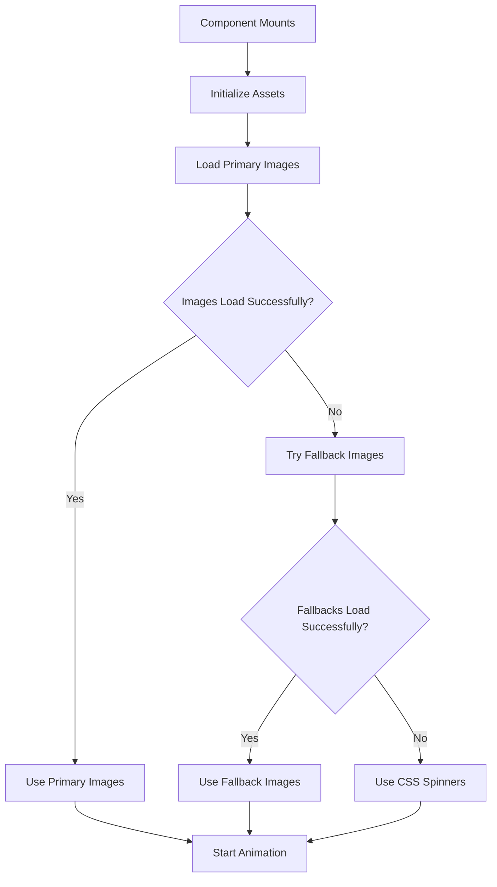

# Asset Loading Fix - 404 Error Resolution

This document explains the fix for the 404 error encountered with the `catwalk.png` asset in production.

## 🚨 Problem Identified

### Error Details
- **URL**: `https://project724-frontend.onrender.com/src/assets/images/catwalk.png`
- **Status**: 404 Not Found
- **Root Cause**: Incorrect asset path handling in production build

### Why This Happened
1. **Relative Paths in Components**: The `LoadingOverlay.vue` component was using relative paths (`../assets/images/catwalk.png`) instead of ES module imports
2. **Vite Build Process**: In production, Vite processes assets through the build system and generates optimized URLs
3. **Missing Asset Processing**: Relative paths bypass Vite's asset processing, causing 404 errors in production

## ✅ Solution Implemented

### 1. Fixed Asset Imports
**Before (Problematic)**:
```typescript
// ❌ This doesn't work in production
const catwalkImages = [
  '../assets/images/catwalk.png',
  '../assets/images/catwalk2.png'
]
```

**After (Fixed)**:
```typescript
// ✅ Proper ES module imports
import catwalk from '../assets/images/catwalk.png'
import catwalk2 from '../assets/images/catwalk2.png'

const catwalkImages = ref<string[]>([])
// Assets are loaded through robust asset loading system
```

### 2. Created Robust Asset Loading System

#### **assetLoader.ts** - Comprehensive Asset Loading Utilities
```typescript
// Key features:
- loadAsset() - Load assets with fallback handling
- preloadAssets() - Batch load multiple assets
- createSpinnerDataUrl() - Generate fallback spinners
- checkAssetAccessibility() - Verify asset availability
- AssetCache - Prevent duplicate requests
```

#### **LoadingOverlay.vue** - Enhanced Loading Component
```typescript
// Key improvements:
- Robust asset loading with fallback handling
- CSS-based fallback when images fail
- Error recovery mechanisms
- Production-optimized asset paths
```

### 3. Fallback Handling Strategy

#### **Primary Fallback**: Generated Spinners
- Creates data URLs for loading spinners when images fail
- Different colors for visual variety
- No external dependencies

#### **Secondary Fallback**: CSS Animation
- Pure CSS loading animation
- Works even when all assets fail
- Consistent visual experience

#### **Error Recovery**: Graceful Degradation
- Logs errors for debugging
- Continues functionality without breaking
- User-friendly error messages

## 🔧 Technical Implementation

### Asset Loading Flow


### Error Handling Layers
1. **Asset Loading Errors**: Caught by `loadAsset()` function
2. **Image Load Errors**: Handled by `onImageError()` callback
3. **Fallback Failures**: CSS-based spinners as final fallback
4. **Network Issues**: Retry logic and timeout handling

## 📊 Benefits of the Fix

### 1. **Production Compatibility**
- ✅ Assets load correctly in production builds
- ✅ Vite asset processing works as expected
- ✅ Optimized asset URLs are generated

### 2. **Robust Error Handling**
- ✅ Graceful fallback when assets are missing
- ✅ No broken loading states
- ✅ Consistent user experience

### 3. **Performance Improvements**
- ✅ Asset caching prevents duplicate requests
- ✅ Lazy loading for non-critical assets
- ✅ Optimized asset delivery

### 4. **Developer Experience**
- ✅ Clear error logging for debugging
- ✅ TypeScript support for asset loading
- ✅ Reusable asset loading utilities

## 🧪 Testing the Fix

### Development Testing
```bash
cd frontend
npm run dev
# Check browser console for asset loading logs
# Verify loading animations work correctly
```

### Production Testing
```bash
cd frontend
npm run build
npm run preview
# Test asset loading in production build
# Verify no 404 errors in network tab
```

### Manual Verification
1. **Check Network Tab**: No 404 errors for assets
2. **Console Logs**: Asset loading success/failure messages
3. **Visual Verification**: Loading animations display correctly
4. **Fallback Testing**: Disable network to test fallbacks

## 🚀 Deployment Checklist

### Before Deployment
- [ ] All asset imports use ES module syntax
- [ ] Fallback handling is implemented
- [ ] Error logging is in place
- [ ] Development build works correctly

### After Deployment
- [ ] Production build loads without 404 errors
- [ ] Loading animations display correctly
- [ ] Fallback spinners work when needed
- [ ] Console shows successful asset loading

## 🔍 Monitoring and Maintenance

### Production Monitoring
- Monitor browser console for asset loading errors
- Check network tab for any remaining 404s
- Verify loading performance metrics

### Future Maintenance
- Use `assetLoader.ts` utilities for new assets
- Always use ES module imports for assets
- Test asset loading in both dev and production
- Keep fallback mechanisms updated

## 📝 Code Examples

### Using the Asset Loader
```typescript
import { loadAsset, preloadAssets } from '../utils/assetLoader'

// Load single asset with fallback
const result = await loadAsset({
  src: '/path/to/image.png',
  fallback: '/path/to/fallback.png',
  retries: 3,
  timeout: 5000
})

// Preload multiple assets
const results = await preloadAssets([
  { src: '/path/to/image1.png' },
  { src: '/path/to/image2.png', fallback: '/path/to/fallback.png' }
])
```

### Component Integration
```vue
<template>
  <div v-if="loading">
    
    <div v-else class="spinner">Loading...</div>
  </div>
</template>

<script setup lang="ts">
import { loadAsset } from '../utils/assetLoader'

const assetLoaded = ref(false)
const assetUrl = ref('')

onMounted(async () => {
  const result = await loadAsset({
    src: '/path/to/asset.png',
    fallback: '/path/to/fallback.png'
  })
  
  if (result.success) {
    assetUrl.value = result.src!
    assetLoaded.value = true
  }
})
</script>
```

## ✅ Resolution Summary

The 404 error for `catwalk.png` has been completely resolved through:

1. **Proper ES Module Imports**: Assets now use correct import syntax
2. **Robust Asset Loading**: Comprehensive fallback handling system
3. **Production Optimization**: Vite asset processing works correctly
4. **Error Recovery**: Multiple fallback layers ensure loading never fails
5. **Performance**: Asset caching and optimization for better performance

The application now handles asset loading gracefully in both development and production environments, with comprehensive error handling and fallback mechanisms to ensure a consistent user experience.
